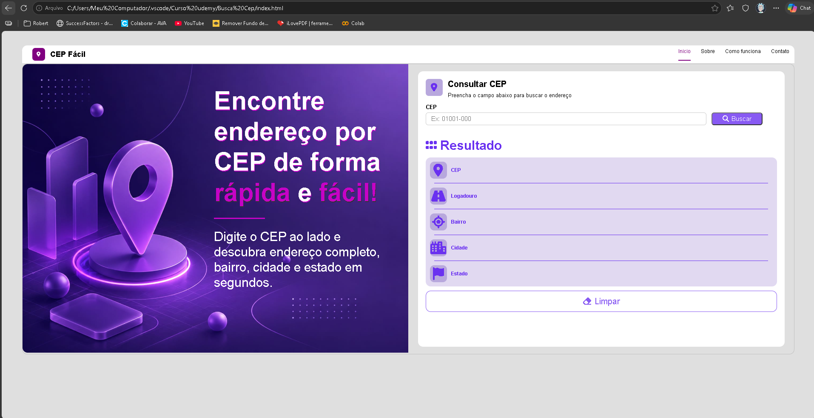

# 📍 CEP Fácil

Aplicação web responsiva para consulta de CEP utilizando a API ViaCEP.

O projeto permite buscar endereços em tempo real e exibir informações completas como:

* CEP
* Logradouro
* Bairro
* Cidade
* Estado

---

## 🚀 Tecnologias utilizadas

* HTML5
* CSS3
* JavaScript
* API ViaCEP
* Font Awesome

---

## ✨ Funcionalidades

✔️ Consulta de CEP em tempo real
✔️ Consumo de API REST com Fetch API
✔️ Validação automática de dígitos
✔️ Bloqueio de letras no input
✔️ Busca ao pressionar Enter
✔️ Limpeza automática dos resultados
✔️ Tratamento para CEP inválido
✔️ Tratamento para CEP inexistente
✔️ Layout responsivo

---

## 🧠 Conceitos praticados

Durante o desenvolvimento deste projeto foram praticados conceitos importantes de Front-End, como:

* Manipulação de DOM
* Eventos com addEventListener
* Requisições assíncronas
* Promises
* Fetch API
* Funções reutilizáveis
* Estruturação de código
* Responsividade com Media Queries
* Validação de formulários

---

## 📷 Preview

---

## 🔗 API utilizada

ViaCEP
https://viacep.com.br/

---

## 📱 Responsividade

O projeto foi desenvolvido para funcionar em:

* Desktop
* Tablet
* Mobile

---

## 📚 Aprendizados

Esse projeto foi importante para fortalecer meus conhecimentos em JavaScript puro, principalmente no consumo de APIs, validação de dados e manipulação de elementos da página em tempo real.

---

## 👩‍💻 Desenvolvedora

Feito por [Sabrina Rodrigues Medeiros](https://github.com/sabrina0604-max)
